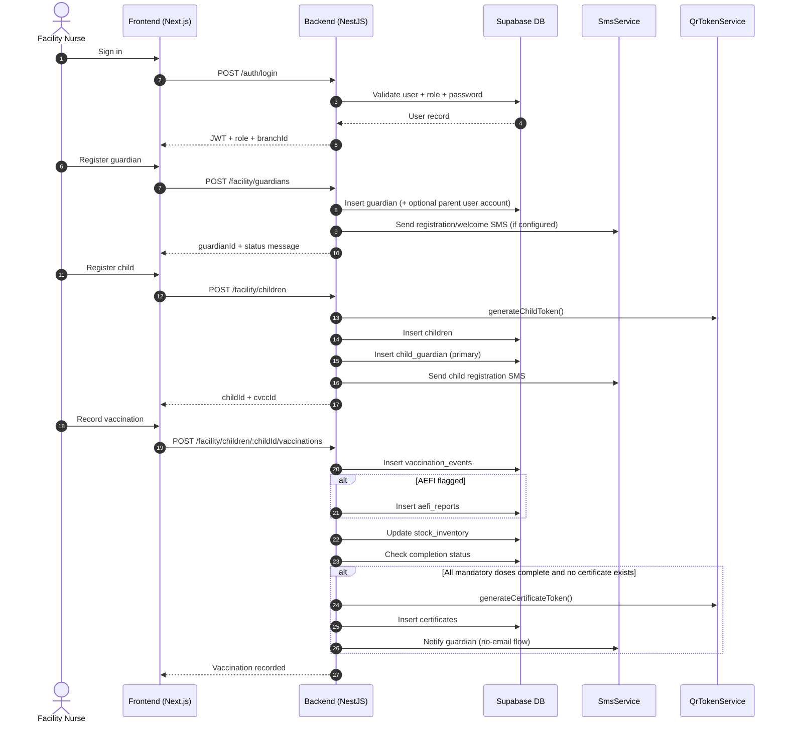
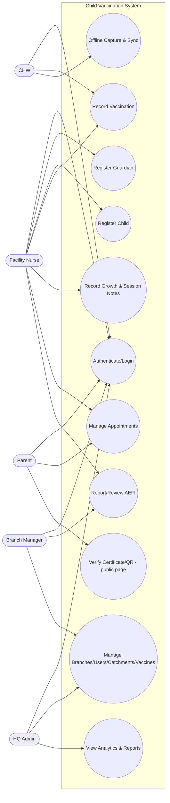
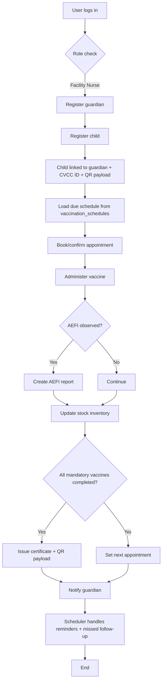
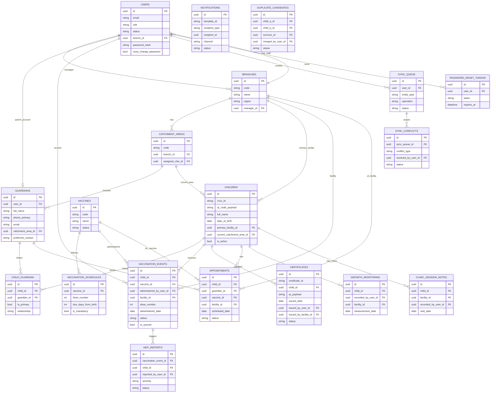
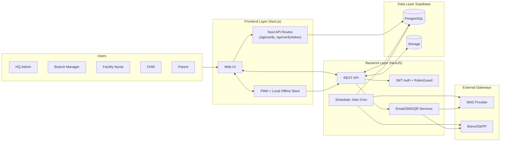
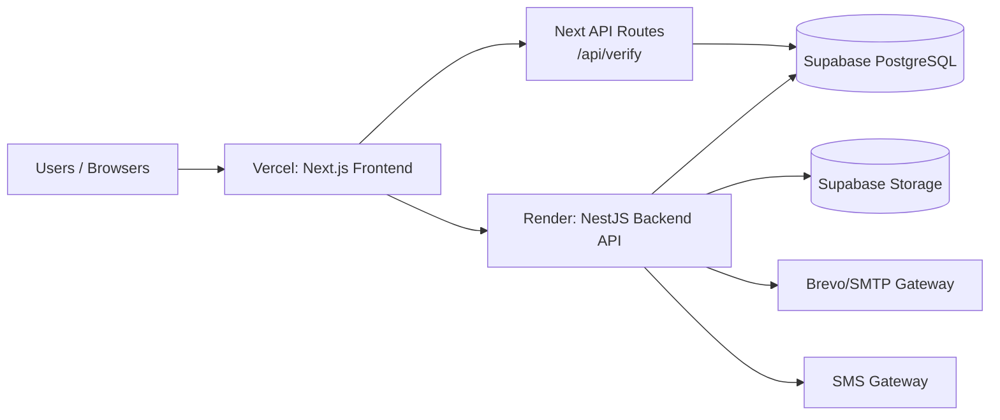

# System Architecture Diagrams

All 10 system diagrams for the Child Vaccination Command Center (CVCC) system.
**Scope: 5 active user roles only** (parent, hq-admin, branch-manager, facility-nurse, chw).
Public certificate verification is a public page, not a user role.

---

## 1. Sequence Diagram (Facility Workflow)



---

## 2. Use Case Diagram (5 README Roles Only)



---

## 3. Flowchart (Core Vaccination Lifecycle)



---

## 4. Database Schema (ERD)



---

## 5. Activity Diagram (Facility Nurse Session - UML Format)

```mermaid
activity
  start
  :Facility Nurse Logs In|
  :Search Child in Dashboard|
  if (Child Exists?) then (Yes)
    :Open Child Chart|
  else (No)
    :Register Guardian\n(POST /facility/guardians)|
    :Register Child\n(POST /facility/children)|
    :Receive childId + CVCC ID|
    :Open Child Chart|
  endif
  :Review Vaccination History\n+ Scheduled Doses|
  :Administer Vaccine\n(POST /facility/children/:childId/vaccinations)|
  if (AEFI Observed?) then (Yes)
    :Create AEFI Report|
  else (No)
  endif
  :Update Stock Inventory|
  :Check Completion Status|
  if (All Mandatory Vaccines\nCompleted + No Certificate?) then (Yes)
    :Auto-Issue Certificate\n+ QR Payload|
    :Send SMS Notification\nto Guardian|
  else (No)
    :Set/Confirm\nNext Appointment|
  endif
  stop
```

---

## 6. System Architecture Diagram (5 Roles Only)



---

## 7. Authentication & Authorization Flow

```mermaid
activity
  start
  :User enters email + password|
  :Submit login form|
  if (Credentials Valid?) then (No)
    :Show error message|
    :User retries|
  else (Yes)
  endif
  :System validates user status + role|
  :Issue access token|
  :User successfully logged in|
  :Route to appropriate dashboard\n(based on role)|
  stop
```

---

## 8. Offline Sync Flow (CHW)

```mermaid
activity
  start
  :CHW captures registration/vaccination offline|
  :Save in local device store|
  if (Data Type) then (Registration)
    :Queue for POST /chw/offline-registrations|
  else (Vaccination)
    :Queue for POST /chw/vaccinations/sync|
  endif
  if (Network Available?) then (No)
    :Keep pending locally|
    note right: Wait for connectivity
  else (Yes)
  endif
  :Send queued payload to backend|
  if (Sync Success?) then (Yes)
    :Mark local item as synced|
  else (Conflict/Error)
    :Record conflict/failure|
    :Add to sync_conflicts for review|
    :Resolve conflict + apply final state|
  endif
  stop
```

---

## 9. Notification Flow

```mermaid
activity
  start
  :Scheduler checks for due vaccinations\nand missed appointments|
  if (Found?) then (Yes)
  else (No)
    :No action needed|
  endif
  :Build SMS/Email notification message|
  :Send notification to guardian/parent|
  if (Delivery Success?) then (Yes)
    :Mark notification as delivered|
  else (Failed)
    :Mark notification as failed|
    :Add to retry queue|
  endif
  if (Manual Retry Needed?) then (Yes)
    :HQ Admin can manually resend|
  else (No)
  endif
  stop
```

---

## 10. Deployment Diagram



---

## Summary

✅ **All 10 diagrams aligned with README scope:**
- 5 active user roles: parent, hq-admin, branch-manager, facility-nurse, chw
- Data Officer & PHA modules excluded (not in active scope)
- Public certificate verification is a public page, not a user role
- Activity Diagram follows proper UML format with decision diamonds and fork/join bars
