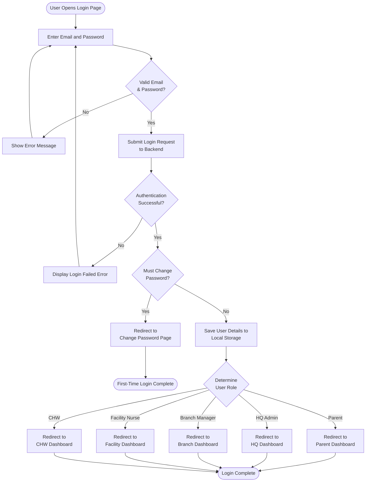
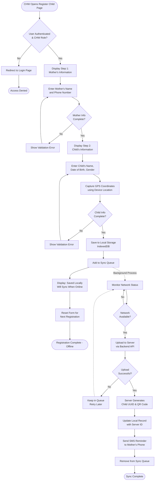
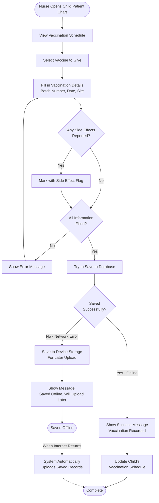
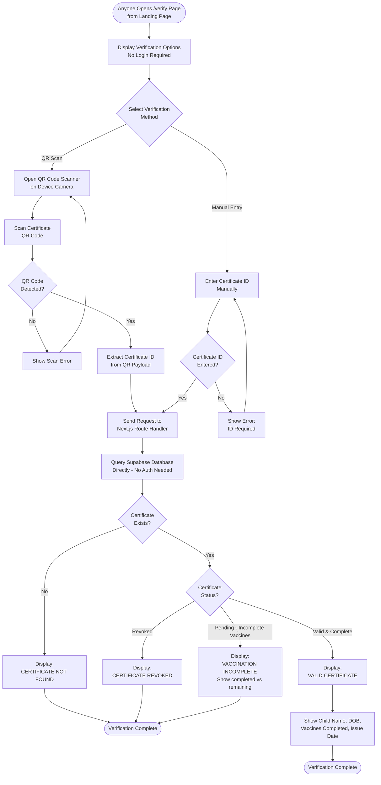
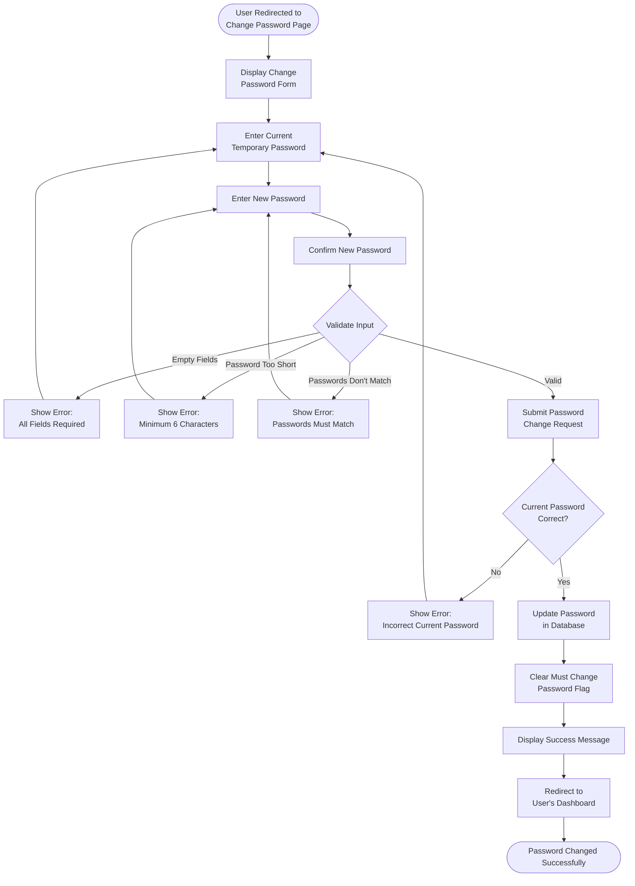
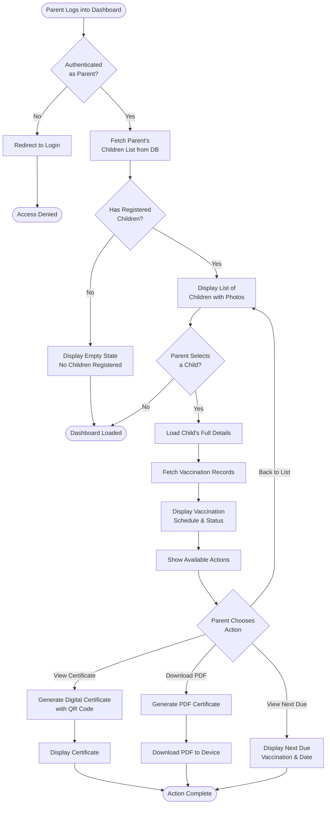
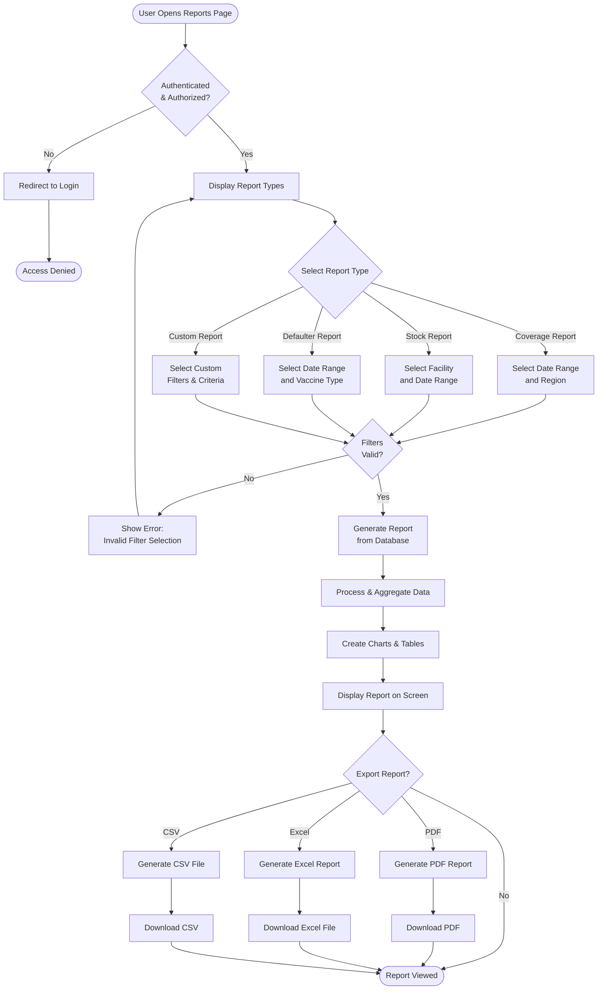
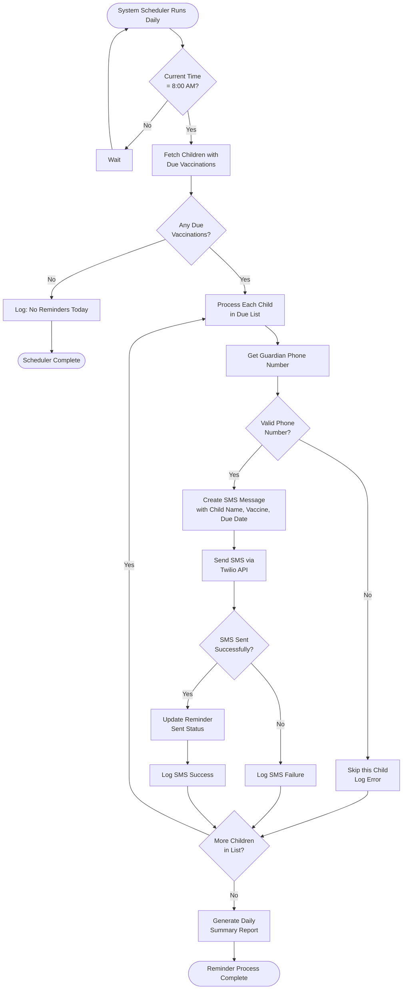
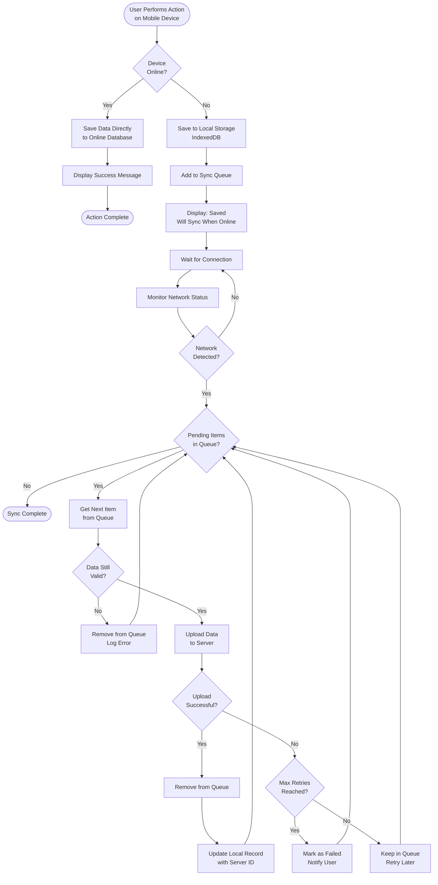
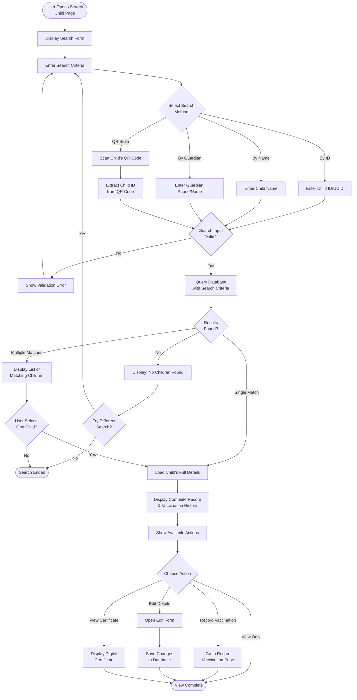

# Child Vaccination System - Flow Diagrams

This document contains simple flow diagrams for the main modules of the Child Vaccination Command Center system.

---

## ⚠️ IMPORTANT: How to Use These Diagrams

### For Mermaid Live Editor (https://mermaid.live):
1. Copy **ONLY the flowchart code** (starting from `flowchart TD` to the last line before `---`)
2. **DO NOT copy** the ` ```mermaid ` or ` ``` ` markers
3. Paste directly into the Mermaid editor

### For GitHub/Markdown Viewers:
- The diagrams will render automatically in GitHub, VS Code, and other Markdown viewers
- No need to copy anything - just view this file

### For PowerPoint/Word:
1. Copy the flowchart code (without ```mermaid markers)
2. Use Mermaid Live Editor to render it
3. Export as PNG/SVG from the editor
4. Insert the image into your document

---

## 1. Login Module (Unified Login for All Users)



### 📋 Copy-Ready Version (For Mermaid Live Editor)
```
flowchart TD
    Start([User Opens Login Page])
    Start --> EnterCredentials[Enter Email and Password]
    EnterCredentials --> Validate{Valid Email<br/>& Password?}
    
    Validate -->|No| ShowError[Show Error Message]
    ShowError --> EnterCredentials
    
    Validate -->|Yes| SubmitLogin[Submit Login Request<br/>to Backend]
    SubmitLogin --> AuthCheck{Authentication<br/>Successful?}
    
    AuthCheck -->|No| DisplayError[Display Login Failed Error]
    DisplayError --> EnterCredentials
    
    AuthCheck -->|Yes| CheckPassword{Must Change<br/>Password?}
    
    CheckPassword -->|Yes| RedirectChange[Redirect to<br/>Change Password Page]
    RedirectChange --> End1([First-Time Login Complete])
    
    CheckPassword -->|No| SaveUserData[Save User Details to<br/>Local Storage]
    SaveUserData --> CheckRole{Determine<br/>User Role}
    
    CheckRole -->|Parent| ParentDash[Redirect to<br/>Parent Dashboard]
    CheckRole -->|HQ Admin| HQDash[Redirect to<br/>HQ Dashboard]
    CheckRole -->|Branch Manager| BranchDash[Redirect to<br/>Branch Dashboard]
    CheckRole -->|Facility Nurse| FacilityDash[Redirect to<br/>Facility Dashboard]
    CheckRole -->|CHW| CHWDash[Redirect to<br/>CHW Dashboard]
    
    ParentDash --> End2([Login Complete])
    HQDash --> End2
    BranchDash --> End2
    FacilityDash --> End2
    CHWDash --> End2
```

---

## 2. Register Child Module (CHW - Community Health Worker)
**Offline-First Registration for Door-to-Door Field Work**



---

## 3. Record Vaccination Module (Facility Nurse)
**Online with Offline Fallback for Power Cuts & Network Issues**



**Note**: When internet connection is restored, the system automatically uploads any offline-saved vaccinations in the background.

---

## 4. Verify Certificate Module (Public - No Login Required)

Accessible from the landing page at `/verify` — anyone can scan or enter a certificate ID.



---

## 5. Change Password Module (First-Time Login)



---

## 6. Parent Dashboard - View Child Records



---

## 7. Generate Reports Module (Branch Manager / HQ Admin)



---

## 8. SMS Reminder System



---

## 9. Offline Sync Module



---

## 10. Search Child Module



---

## Notes for Presentation

### How to Use These Diagrams:

1. **Login Module**: Shows how all users (parents and staff) log in and get redirected to their specific dashboards
2. **Register Child Module (CHW)**: Demonstrates the offline-first registration process for door-to-door field work - saves locally first, then syncs to server when network is available
3. **Record Vaccination Module (Facility Nurse)**: Shows the online-with-offline-fallback design for recording vaccinations at facilities - handles power cuts and network interruptions gracefully
4. **Verify Certificate Module (Public)**: Shows how anyone can verify a certificate from the landing page using QR scan or manual entry — no login required
5. **Change Password Module**: Explains the first-time login password change flow
6. **Parent Dashboard**: How parents view their children's vaccination records
7. **Generate Reports**: How Branch Managers and HQ Admins generate various reports
8. **SMS Reminder System**: Automated daily process for sending vaccination reminders
9. **Offline Sync Module**: How the system handles offline mode and synchronizes data
10. **Search Child Module**: How staff search for children using different methods

### Key Features Highlighted:
- ✅ **Offline capability** with local storage and sync
- ✅ **Role-based access** control (different dashboards for different users)
- ✅ **QR code** functionality for verification and searching
- ✅ **GPS tracking** for community health worker registrations
- ✅ **SMS reminders** for vaccination due dates
- ✅ **Multi-method search** (ID, name, guardian, QR code)
- ✅ **Certificate verification** — public page, no login required
- ✅ **Report generation** with multiple export formats

### Important Implementation Details:
- **CHW Registration (Module 2)**: ✅ **Implemented** - Offline-first field work. Always saves to local storage immediately, then syncs to server in background when network becomes available. Perfect for rural/remote areas.
- **Record Vaccination (Module 3)**: 🔄 **To Be Implemented** - Online-with-offline-fallback design. Tries API first, if network fails saves to IndexedDB and syncs later. Critical for handling power cuts and network interruptions at facilities.
- **Offline Sync (Module 9)**: Generic background sync process. Currently used by CHW registration, will also be used by vaccination recording once offline fallback is implemented.

### Implementation Guide for Offline Vaccination Recording:
1. **Try to save online first** - Always attempt to save to database when internet is available
2. **If network fails** - Save vaccination details to device storage (local database)
3. **Show clear message** - Tell nurse if saved online or saved offline
4. **Auto-upload later** - When internet comes back, system automatically uploads saved records
5. **Simple user experience** - Nurse doesn't need to do anything special, system handles it automatically

These diagrams are based on the actual implementation in your codebase and reflect real workflows.
