# Chapter 4 Diagrams (Mermaid)

## Activity Diagram (Main System Workflow)

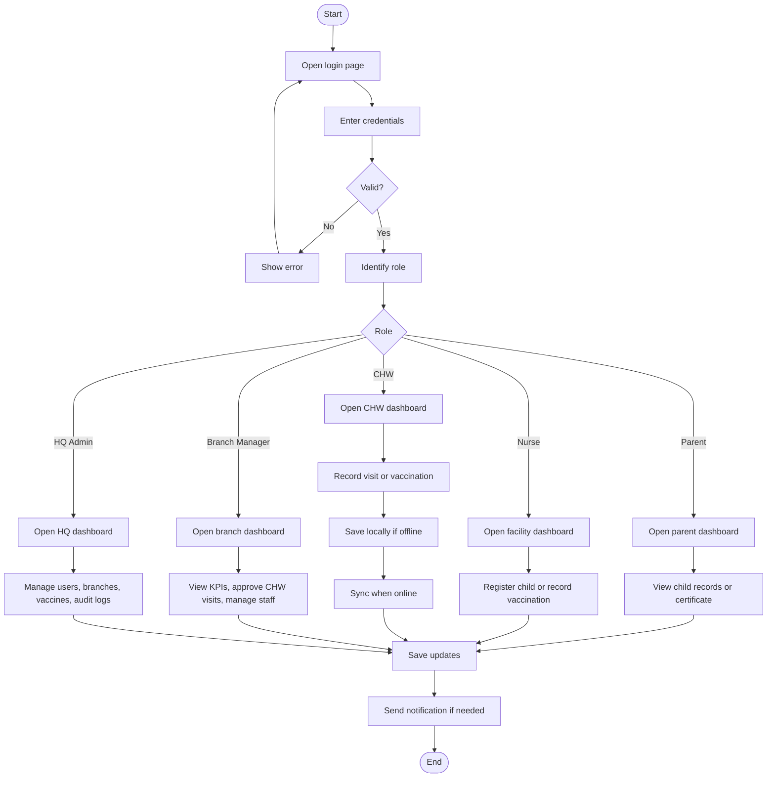

## Use Case Diagram (All 5 Roles)

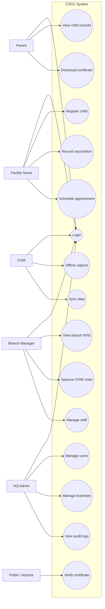

## State Diagram (CHW Offline Capture and Sync)

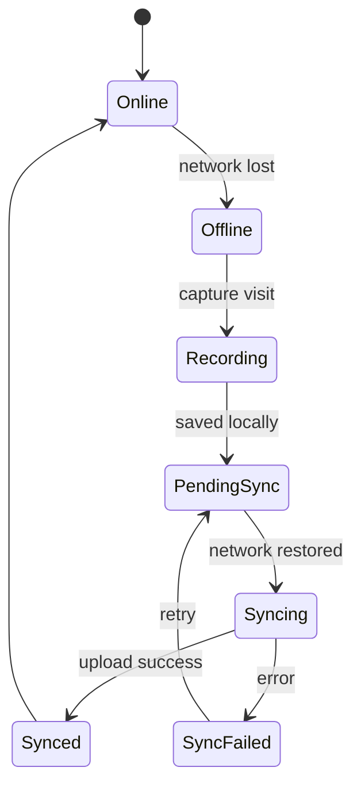

## Deployment Diagram

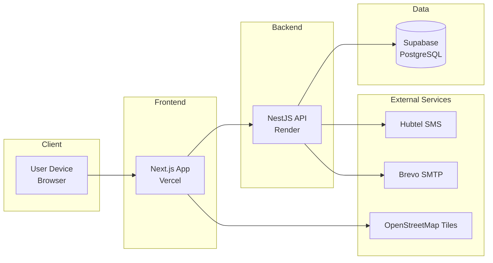

## Class Diagram (Small, 10 Classes)

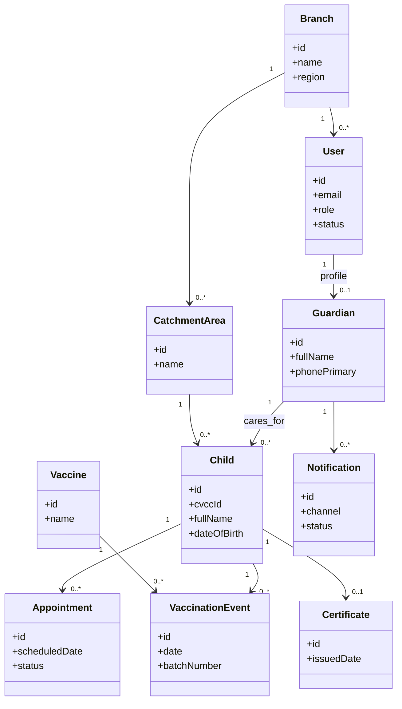

## Sequence Diagram (Unified Login and Role Routing)

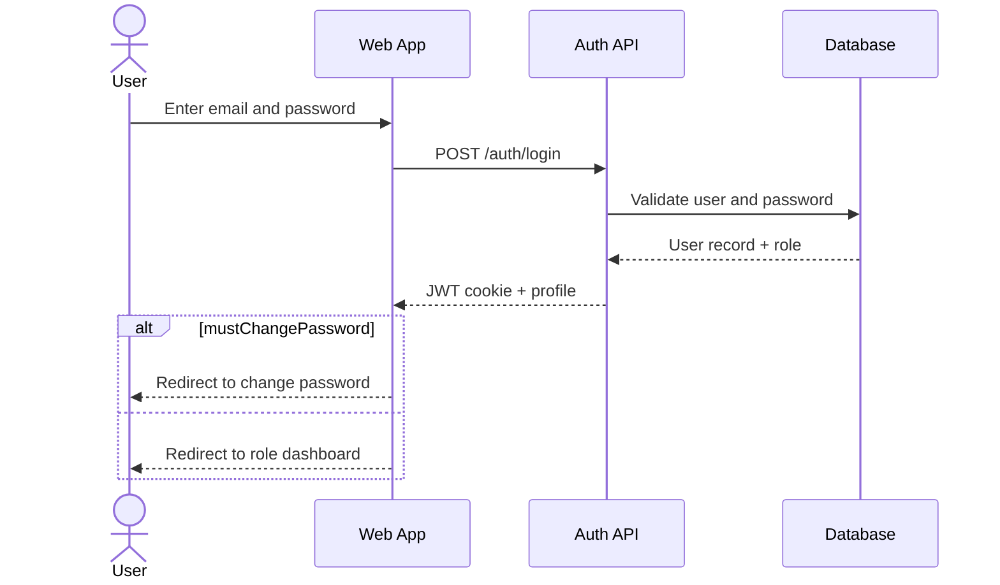

---

## Sequence Diagram (Record Vaccination — Facility Nurse)

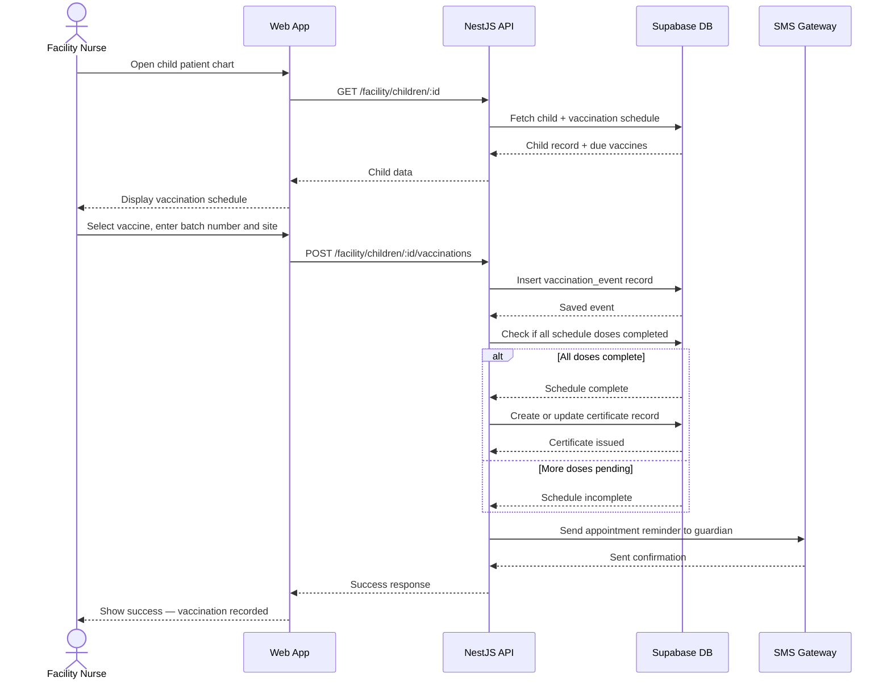

---

## Sequence Diagram (CHW Offline Registration and Sync)

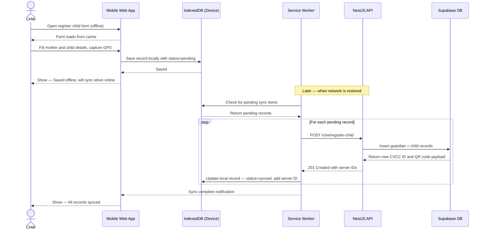

---

## Sequence Diagram (Public Certificate Verification)

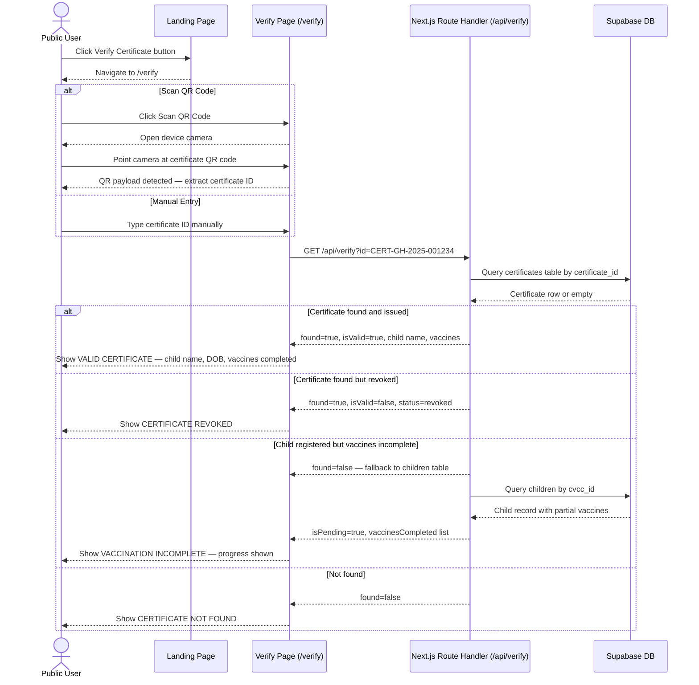

---

## Entity-Relationship Diagram (ERD)

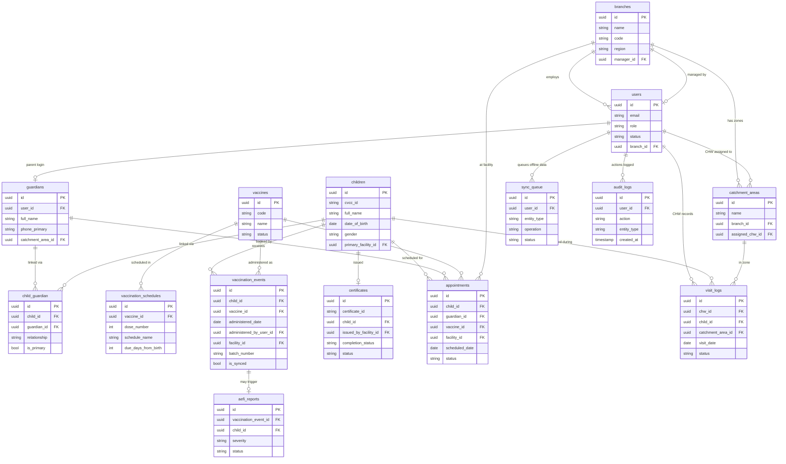

---

## System Architecture Diagram

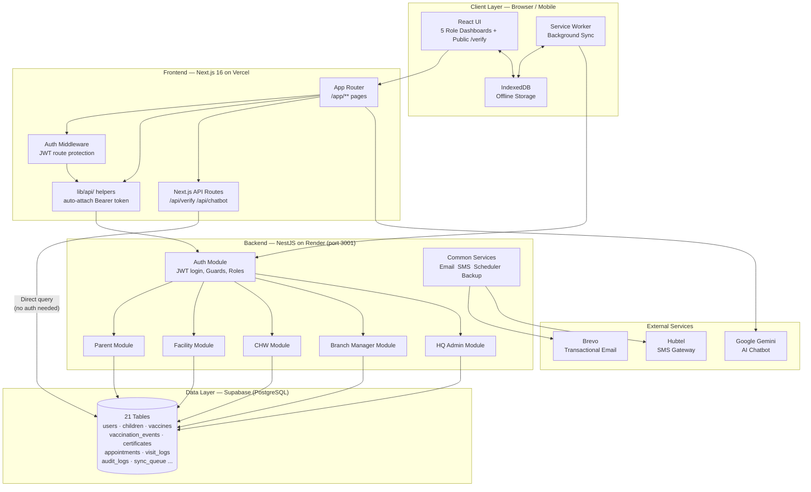
