# Chapter 4: System Architecture and Diagrams

This document contains all the diagrams needed for Chapter 4 of the project documentation.

---

## Table of Contents

1. [System Overview](#1-system-overview)
2. [Flowcharts](#2-flowcharts)
   - 2.1 [Login with RBAC Flow](#21-login-with-rbac-flow)
   - 2.2 [Mother/Guardian Registration Flow](#22-motherguardian-registration-flow)
   - 2.3 [Child Registration Flow](#23-child-registration-flow)
   - 2.4 [Vaccination Administration Flow](#24-vaccination-administration-flow)
   - 2.5 [SMS Notification Flow](#25-sms-notification-flow)
   - 2.6 [CHW Offline Vaccination Flow](#26-chw-offline-vaccination-flow)
3. [Activity Diagrams](#3-activity-diagrams)
   - 3.1 [Vaccination Workflow Activity](#31-vaccination-workflow-activity)
   - 3.2 [CHW Outreach Activity](#32-chw-outreach-activity)
4. [Use Case Diagrams](#4-use-case-diagrams)
   - 4.1 [System Use Case Overview](#41-system-use-case-overview)
   - 4.2 [Parent Use Cases](#42-parent-use-cases)
   - 4.3 [Facility Nurse Use Cases](#43-facility-nurse-use-cases)
   - 4.4 [CHW Use Cases](#44-chw-use-cases)
   - 4.5 [Branch Manager Use Cases](#45-branch-manager-use-cases)
   - 4.6 [HQ Admin Use Cases](#46-hq-admin-use-cases)
   - 4.7 [PHA Use Cases](#47-pha-use-cases)
   - 4.8 [Data Officer Use Cases](#48-data-officer-use-cases)
5. [Sequence Diagrams](#5-sequence-diagrams)
   - 5.1 [User Login Sequence](#51-user-login-sequence)
   - 5.2 [Vaccination Recording Sequence](#52-vaccination-recording-sequence)
   - 5.3 [SMS Notification Sequence](#53-sms-notification-sequence)
   - 5.4 [CHW Offline Sync Sequence](#54-chw-offline-sync-sequence)
6. [Database Schema](#6-database-schema)
   - 6.1 [Entity Relationship Diagram](#61-entity-relationship-diagram)
   - 6.2 [Core Tables Overview](#62-core-tables-overview)
   - 6.3 [Table Relationships Explained](#63-table-relationships-explained)
   - 6.4 [Foreign Keys Explained](#64-foreign-keys-explained)
7. [Screenshots Checklist](#7-screenshots-checklist)

---

## 1. System Overview

The Child Vaccination Command Center (CVCC) is a multi-tenant health management system for tracking childhood vaccinations in Ghana. The system supports 7 user roles with role-based access control (RBAC).

### User Roles

| Role | Description |
|------|-------------|
| HQ Admin | National-level system administrator |
| Branch Manager | Regional/district facility manager |
| Facility Nurse | Healthcare facility nursing staff |
| CHW | Community Health Worker for field outreach |
| Data Officer | Data quality and deduplication |
| PHA | Public Health Authority (government) |
| Parent | Parents/Guardians of children |

---

## 2. Flowcharts

### 2.1 Login with RBAC Flow

This flowchart shows how the system authenticates users and redirects them to their respective dashboards based on their role.

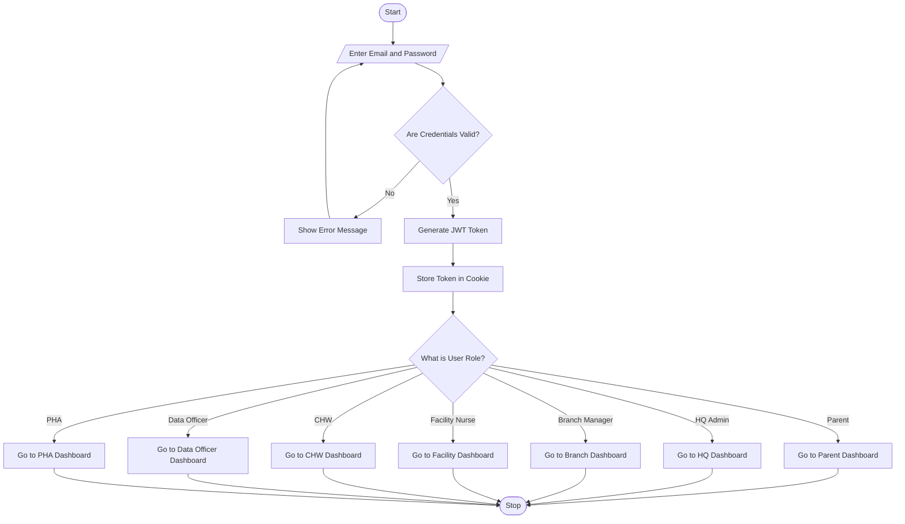

---

### 2.2 Mother/Guardian Registration Flow

This flowchart shows how a mother/guardian is registered in the system by facility staff.

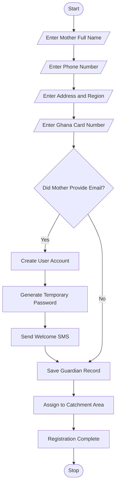

---

### 2.3 Child Registration Flow

This flowchart shows the complete child registration process.

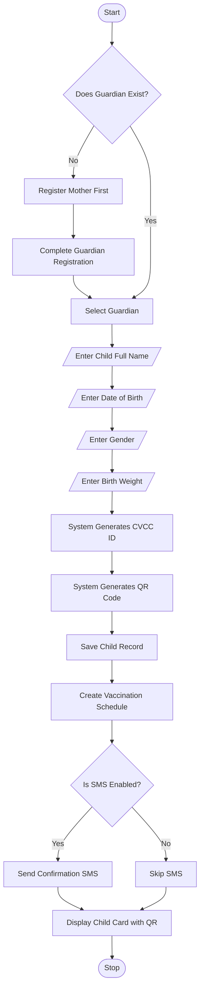

---

### 2.4 Vaccination Administration Flow

This flowchart shows how a vaccination is administered at a facility.

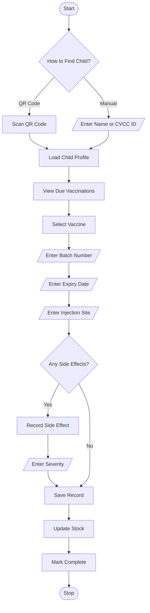

---

### 2.5 SMS Notification Flow

This flowchart shows how SMS reminders are sent to parents.

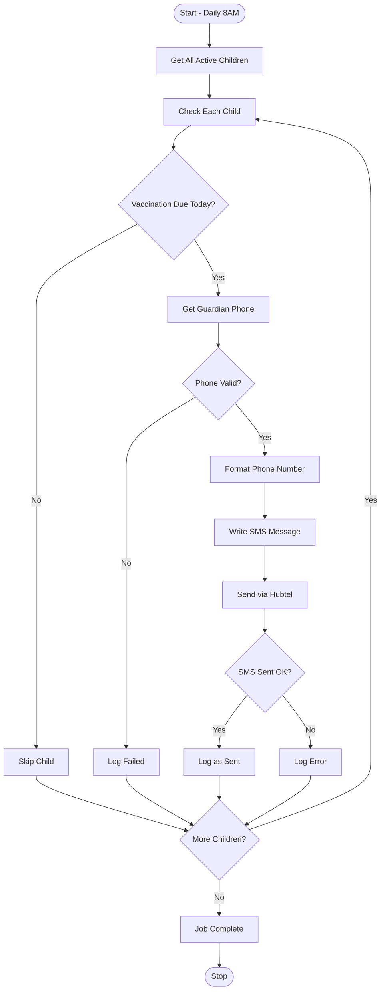

---

### 2.6 CHW Offline Vaccination Flow

This flowchart shows how CHWs record vaccinations offline and sync when connected.

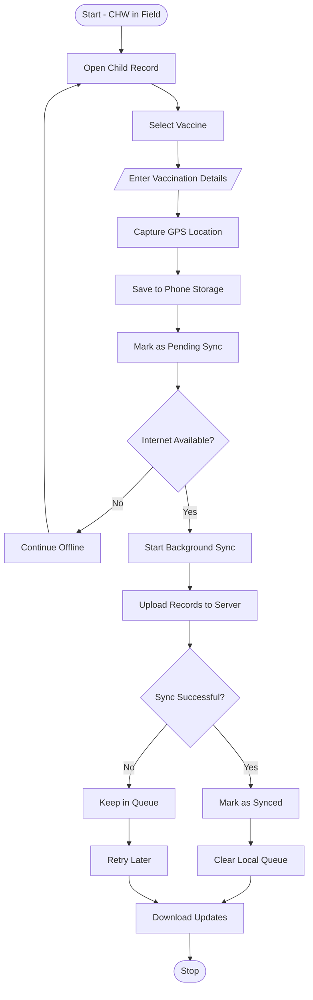

---

## 3. Activity Diagrams

### 3.1 Vaccination Workflow Activity

This activity diagram shows the complete vaccination workflow from scheduling to completion.

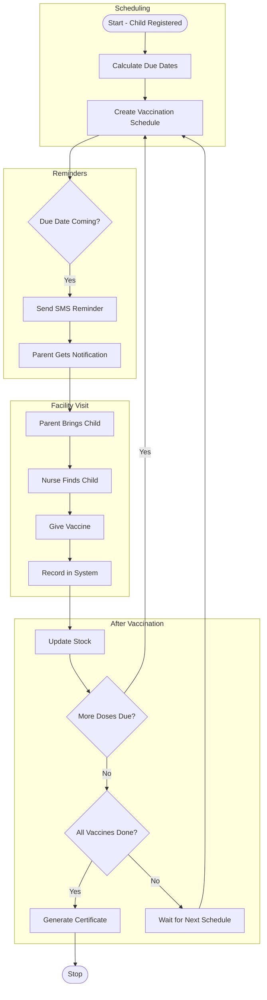

---

### 3.2 CHW Outreach Activity

This activity diagram shows the CHW field outreach workflow.

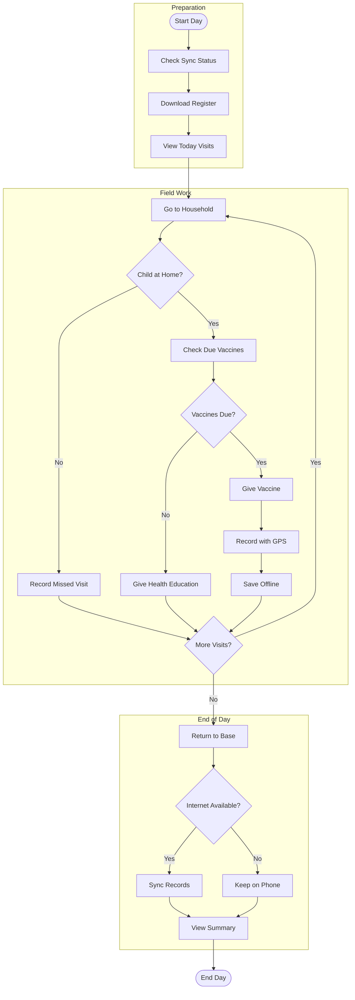

---

## 4. Use Case Diagrams

### 4.1 System Use Case Overview

This diagram shows all actors and their high-level interactions with the system.

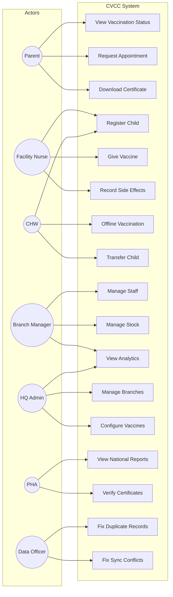

---

### 4.2 Parent Use Cases

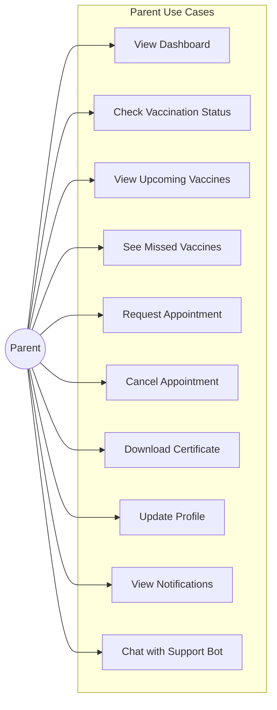

---

### 4.3 Facility Nurse Use Cases

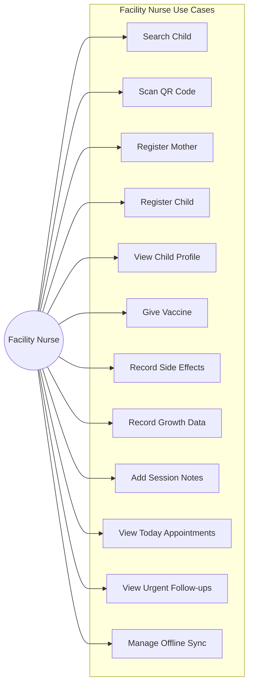

---

### 4.4 CHW Use Cases

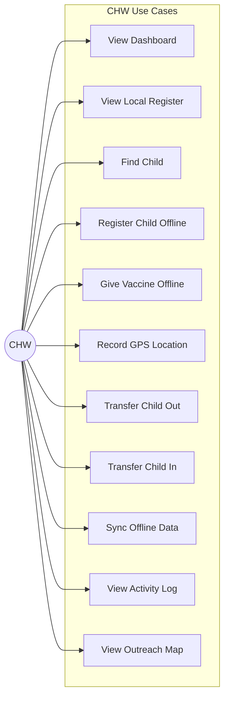

---

### 4.5 Branch Manager Use Cases

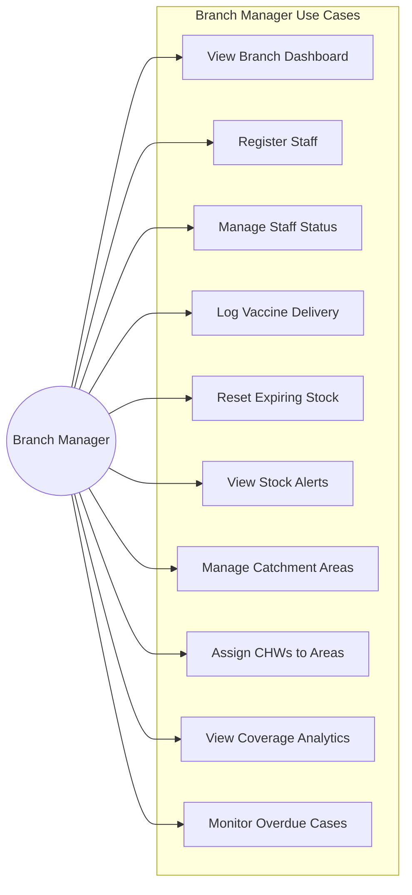

---

### 4.6 HQ Admin Use Cases

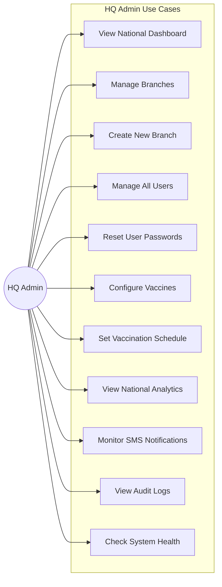

---

### 4.7 PHA Use Cases

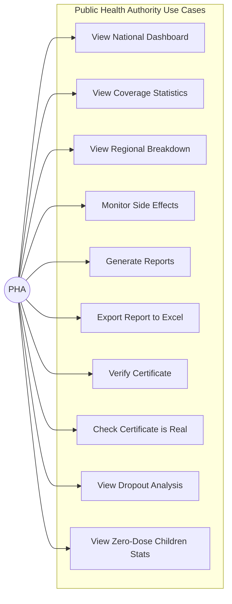

---

### 4.8 Data Officer Use Cases

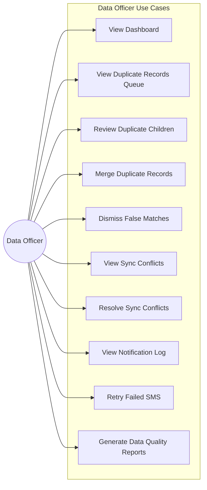

---

## 5. Sequence Diagrams

### 5.1 User Login Sequence

This diagram shows the step-by-step process when a user logs into the system.

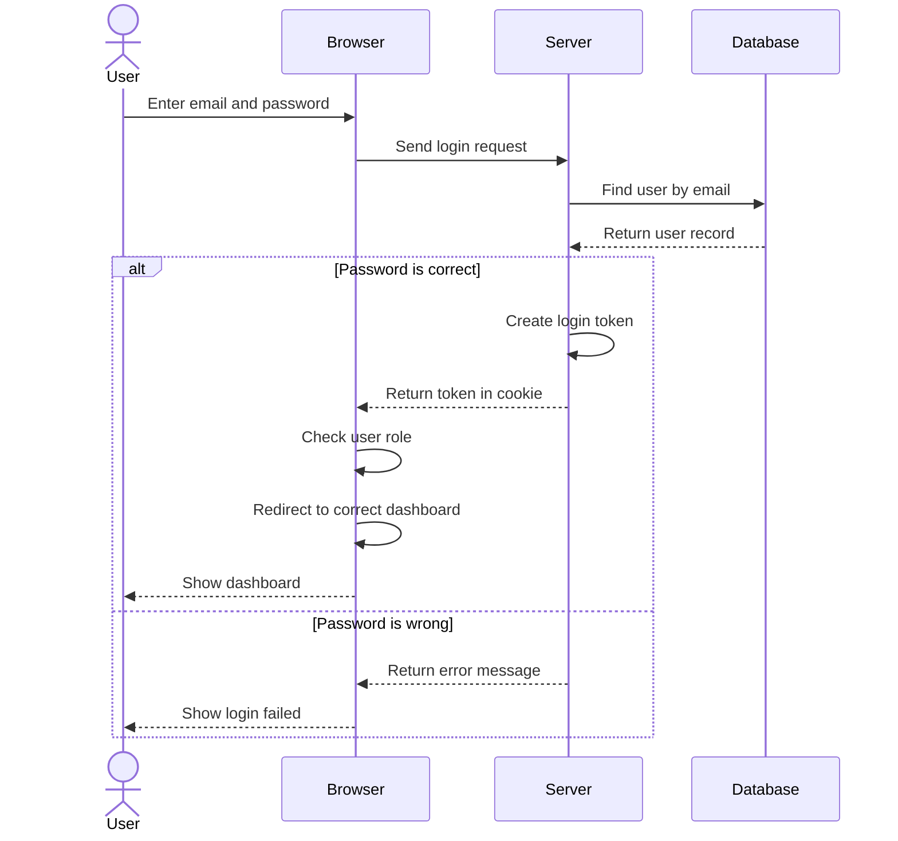

---

### 5.2 Vaccination Recording Sequence

This diagram shows how a vaccination is recorded in the system.

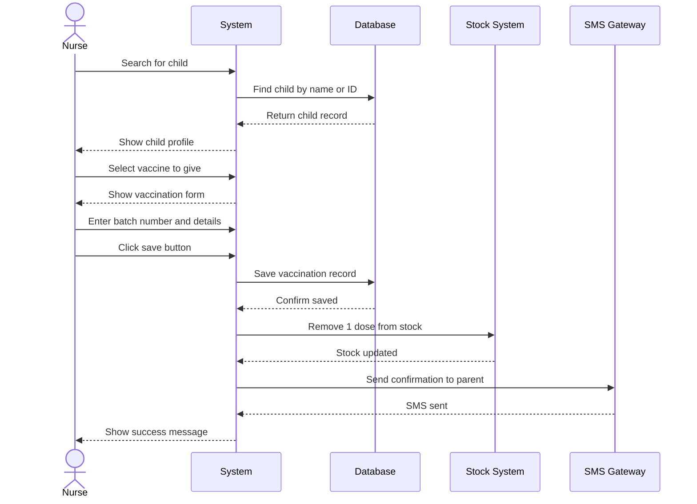

---

### 5.3 SMS Notification Sequence

This diagram shows how SMS reminders are sent to parents.

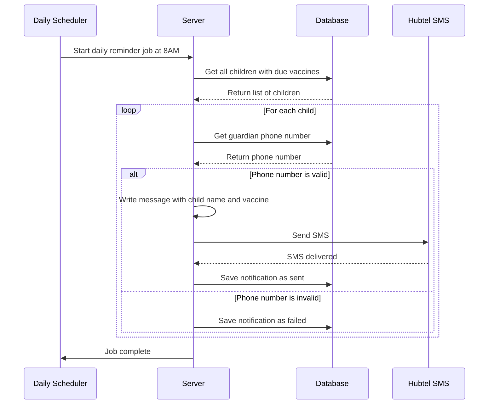

---

### 5.4 CHW Offline Sync Sequence

This diagram shows how CHW phones sync data with the server.

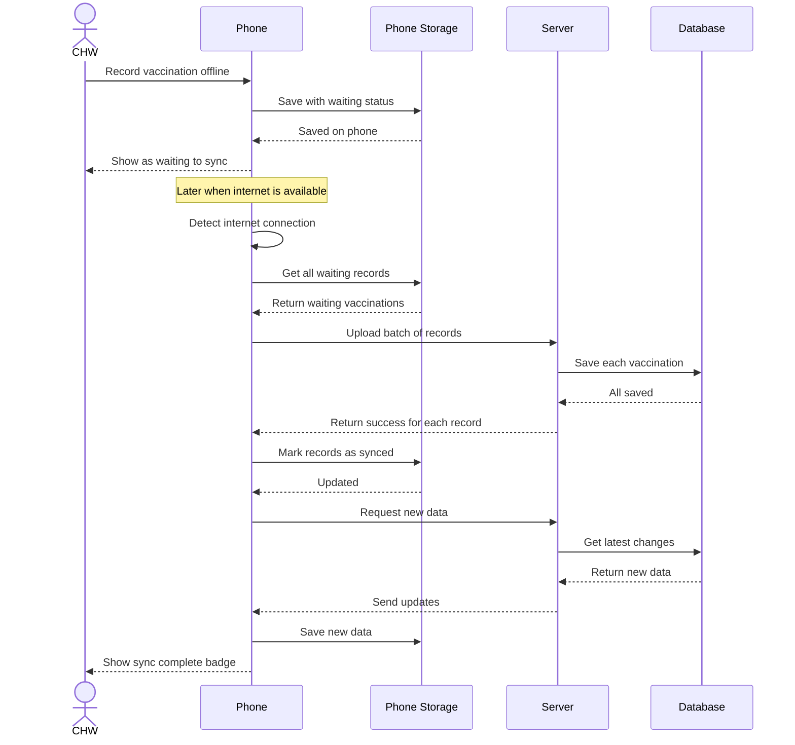

---

## 6. Database Schema

### 6.1 Entity Relationship Diagram

This diagram shows the main entities and their relationships.

```mermaid
erDiagram
    USERS ||--o{ BRANCHES : manages
    USERS ||--o{ GUARDIANS : creates
    USERS ||--o{ CHILDREN : registers
    USERS ||--o{ VACCINATION_EVENTS : administers
    USERS ||--o{ CATCHMENT_AREAS : assigned_to

    BRANCHES ||--o{ USERS : employs
    BRANCHES ||--o{ CATCHMENT_AREAS : contains
    BRANCHES ||--o{ CHILDREN : primary_facility
    BRANCHES ||--o{ STOCK_INVENTORY : stores

    CATCHMENT_AREAS ||--o{ GUARDIANS : residence
    CATCHMENT_AREAS ||--o{ CHILDREN : current_area

    GUARDIANS ||--o{ CHILD_GUARDIAN : has
    CHILDREN ||--o{ CHILD_GUARDIAN : has

    CHILDREN ||--o{ VACCINATION_EVENTS : receives
    CHILDREN ||--o{ APPOINTMENTS : scheduled
    CHILDREN ||--o{ CERTIFICATES : issued
    CHILDREN ||--o{ GROWTH_MONITORING : measured
    CHILDREN ||--o{ AEFI_REPORTS : experiences

    VACCINES ||--o{ VACCINATION_SCHEDULES : defines
    VACCINES ||--o{ VACCINATION_EVENTS : administered
    VACCINES ||--o{ APPOINTMENTS : for
    VACCINES ||--o{ STOCK_INVENTORY : tracked

    VACCINATION_EVENTS ||--o| AEFI_REPORTS : triggers

    USERS {
        uuid id PK
        string email UK
        string full_name
        enum role
        uuid branch_id FK
        enum status
    }

    BRANCHES {
        uuid id PK
        string name
        string code UK
        string region
        point gps_coordinates
        uuid manager_id FK
    }

    CATCHMENT_AREAS {
        uuid id PK
        string name
        string code UK
        uuid branch_id FK
        uuid assigned_chw_id FK
        polygon boundary
    }

    GUARDIANS {
        uuid id PK
        string full_name
        string phone_primary
        uuid user_id FK
        uuid catchment_area_id FK
    }

    CHILDREN {
        uuid id PK
        string cvcc_id UK
        string qr_code_payload UK
        string full_name
        date date_of_birth
        enum gender
        uuid primary_facility_id FK
        uuid current_catchment_area_id FK
    }

    CHILD_GUARDIAN {
        uuid id PK
        uuid child_id FK
        uuid guardian_id FK
        string relationship
        boolean is_primary
    }

    VACCINES {
        uuid id PK
        string code UK
        string name
        enum status
    }

    VACCINATION_SCHEDULES {
        uuid id PK
        uuid vaccine_id FK
        int dose_number
        string schedule_name
        int due_days_from_birth
    }

    VACCINATION_EVENTS {
        uuid id PK
        uuid child_id FK
        uuid vaccine_id FK
        int dose_number
        date administered_date
        uuid administered_by_user_id FK
        uuid facility_id FK
        string batch_number
        enum status
        point gps_coordinates
    }

    APPOINTMENTS {
        uuid id PK
        uuid child_id FK
        uuid guardian_id FK
        uuid vaccine_id FK
        uuid facility_id FK
        date scheduled_date
        enum status
    }

    CERTIFICATES {
        uuid id PK
        string certificate_id UK
        uuid child_id FK
        string qr_payload UK
        enum status
    }

    AEFI_REPORTS {
        uuid id PK
        uuid vaccination_event_id FK
        uuid child_id FK
        array symptoms
        enum severity
        enum status
    }

    STOCK_INVENTORY {
        uuid id PK
        uuid vaccine_id FK
        uuid facility_id FK
        string batch_number
        date expiry_date
        int quantity_remaining
    }

    GROWTH_MONITORING {
        uuid id PK
        uuid child_id FK
        date measurement_date
        decimal weight_kg
        decimal height_cm
    }

    NOTIFICATIONS {
        uuid id PK
        string template_id
        uuid recipient_id
        enum channel
        string message
        enum status
    }
```

---

### 6.2 Core Tables Overview

| Table | What It Stores | Important Fields |
|-------|----------------|------------------|
| `users` | All people who use the system (nurses, CHWs, parents, admins) | id, email, role, branch_id, status |
| `branches` | Health facilities (hospitals, clinics) | id, name, code, region, manager_id |
| `catchment_areas` | Geographic zones that CHWs are assigned to | id, name, branch_id, assigned_chw_id |
| `guardians` | Parents and caretakers of children | id, full_name, phone_primary |
| `children` | Children registered for vaccination | id, cvcc_id, qr_code_payload, date_of_birth |
| `child_guardian` | Links children to their parents | child_id, guardian_id, is_primary |
| `vaccines` | List of available vaccines (BCG, Penta, etc.) | id, code, name, status |
| `vaccination_schedules` | When each vaccine should be given | vaccine_id, dose_number, due_days_from_birth |
| `vaccination_events` | Records of vaccines that were given | child_id, vaccine_id, administered_date |
| `appointments` | Scheduled vaccination visits | child_id, vaccine_id, scheduled_date |
| `certificates` | Vaccination completion certificates | certificate_id, child_id, qr_payload |
| `aefi_reports` | Reports of side effects after vaccination | vaccination_event_id, symptoms, severity |
| `stock_inventory` | How many vaccines each facility has | vaccine_id, facility_id, quantity_remaining |
| `notifications` | SMS and email messages sent | recipient_id, message, status |
| `audit_logs` | Record of all actions in the system | user_id, action, entity_type |

---

### 6.3 Table Relationships Explained

This section explains how the tables are connected to each other in simple terms.

#### Users and Branches
- A **user** (like a nurse or CHW) works at one **branch** (health facility)
- A **branch** can have many **users** working there
- One user can be the **manager** of a branch

**Example:** Nurse Akosua works at Korle-Bu Clinic. Korle-Bu Clinic has 5 nurses and 3 CHWs. Dr. Mensah is the manager of Korle-Bu.

#### Branches and Catchment Areas
- A **branch** covers multiple **catchment areas** (neighborhoods or villages)
- Each **catchment area** belongs to only one **branch**
- Each **catchment area** is assigned to one **CHW** who visits homes there

**Example:** Korle-Bu Clinic covers 3 catchment areas: Osu, Labadi, and Teshie. CHW Kofi is assigned to Osu.

#### Guardians and Children
- A **guardian** (mother/father) can have many **children**
- A **child** can have multiple **guardians** (mother, father, grandparent)
- The **child_guardian** table connects children to their guardians
- One guardian is marked as the **primary** contact (who receives SMS)

**Example:** Mama Ama has 3 children: Kwame, Yaa, and Kofi. Papa Kweku is also a guardian for the same children. Mama Ama is the primary contact.

#### Children and Vaccinations
- A **child** receives many **vaccination events** over time
- Each **vaccination event** records one dose of one vaccine given
- The **vaccination_schedules** table says when each vaccine is due

**Example:** Baby Kwame: BCG at birth, Penta 1 at 6 weeks, Penta 2 at 10 weeks, etc.

#### Vaccines and Stock
- Each **vaccine** is tracked in the **stock_inventory** table
- Each **branch** keeps its own stock of each vaccine
- When a vaccine is given, the stock goes down by 1

**Example:** Korle-Bu has 500 doses of BCG and 300 doses of Penta. When one BCG is given, it becomes 499.

#### Side Effects (AEFI)
- A **vaccination event** can sometimes cause side effects
- The **aefi_reports** table records what symptoms happened and how serious

**Example:** After Penta vaccine, baby had fever and crying. Nurse records: symptoms = "fever, irritability", severity = "mild"

#### Appointments
- A **child** can have many **appointments** scheduled
- Each **appointment** is for a specific **vaccine** at a specific **facility**
- The **guardian** gets an SMS reminder

**Example:** Baby Yaa has appointment on Monday at Korle-Bu for Measles vaccine.

---

### 6.4 Foreign Keys Explained

A **foreign key** is like a pointer or reference. It says "this record belongs to that record in another table."

Think of it like a phone number - when you save someone's number in your phone, you can call them anytime. Foreign keys work the same way - they let tables "call" each other.

#### USERS Table Foreign Keys

| Field | Points To | What It Means |
|-------|-----------|---------------|
| `branch_id` | branches.id | Which health facility does this user work at? |

**Example:** If Nurse Akosua's `branch_id` is "abc-123", and Korle-Bu's `id` is "abc-123", then Nurse Akosua works at Korle-Bu.

#### BRANCHES Table Foreign Keys

| Field | Points To | What It Means |
|-------|-----------|---------------|
| `manager_id` | users.id | Who is the manager of this facility? |

**Example:** Korle-Bu's `manager_id` points to Dr. Mensah's user record.

#### CATCHMENT_AREAS Table Foreign Keys

| Field | Points To | What It Means |
|-------|-----------|---------------|
| `branch_id` | branches.id | Which facility is responsible for this area? |
| `assigned_chw_id` | users.id | Which CHW visits homes in this area? |

**Example:** Osu catchment area's `branch_id` points to Korle-Bu, and `assigned_chw_id` points to CHW Kofi.

#### GUARDIANS Table Foreign Keys

| Field | Points To | What It Means |
|-------|-----------|---------------|
| `user_id` | users.id | If the parent has a login account, this links to it |
| `catchment_area_id` | catchment_areas.id | Which neighborhood does this parent live in? |

**Example:** Mama Ama lives in Osu, so her `catchment_area_id` points to Osu catchment record.

#### CHILDREN Table Foreign Keys

| Field | Points To | What It Means |
|-------|-----------|---------------|
| `primary_facility_id` | branches.id | Which facility is this child registered at? |
| `current_catchment_area_id` | catchment_areas.id | Which CHW area does this child belong to? |

**Example:** Baby Kwame is registered at Korle-Bu and lives in the Osu catchment area.

#### CHILD_GUARDIAN Table Foreign Keys

| Field | Points To | What It Means |
|-------|-----------|---------------|
| `child_id` | children.id | Which child is this about? |
| `guardian_id` | guardians.id | Which parent/guardian is this about? |

**Example:** One record links Baby Kwame to Mama Ama (primary), another links Baby Kwame to Papa Kweku.

#### VACCINATION_SCHEDULES Table Foreign Keys

| Field | Points To | What It Means |
|-------|-----------|---------------|
| `vaccine_id` | vaccines.id | Which vaccine is this schedule for? |

**Example:** Schedule record says "Penta vaccine, dose 1, due at 42 days old"

#### VACCINATION_EVENTS Table Foreign Keys

| Field | Points To | What It Means |
|-------|-----------|---------------|
| `child_id` | children.id | Which child got this vaccine? |
| `vaccine_id` | vaccines.id | Which vaccine was given? |
| `administered_by_user_id` | users.id | Which nurse/CHW gave it? |
| `facility_id` | branches.id | Where was it given? |

**Example:** Baby Kwame got Penta 1 from Nurse Akosua at Korle-Bu on March 15.

#### APPOINTMENTS Table Foreign Keys

| Field | Points To | What It Means |
|-------|-----------|---------------|
| `child_id` | children.id | Which child is the appointment for? |
| `guardian_id` | guardians.id | Which parent made the appointment? |
| `vaccine_id` | vaccines.id | Which vaccine is the appointment for? |
| `facility_id` | branches.id | Where is the appointment? |

**Example:** Mama Ama booked Baby Yaa for Measles vaccine at Korle-Bu on Monday.

#### CERTIFICATES Table Foreign Keys

| Field | Points To | What It Means |
|-------|-----------|---------------|
| `child_id` | children.id | Which child does this certificate belong to? |

**Example:** Certificate #GH-2024-001 belongs to Baby Kwame who completed all vaccines.

#### AEFI_REPORTS Table Foreign Keys

| Field | Points To | What It Means |
|-------|-----------|---------------|
| `vaccination_event_id` | vaccination_events.id | Which vaccination caused this side effect? |
| `child_id` | children.id | Which child had the side effect? |

**Example:** Baby Kofi had fever after his Penta 2 vaccination.

#### STOCK_INVENTORY Table Foreign Keys

| Field | Points To | What It Means |
|-------|-----------|---------------|
| `vaccine_id` | vaccines.id | Which vaccine is this stock for? |
| `facility_id` | branches.id | Which facility has this stock? |

**Example:** Korle-Bu has 500 doses of BCG vaccine, batch #BCG-2024-A, expires Dec 2024.

#### GROWTH_MONITORING Table Foreign Keys

| Field | Points To | What It Means |
|-------|-----------|---------------|
| `child_id` | children.id | Which child was measured? |

**Example:** Baby Kwame weighed 4.5kg on March 15.

---

### Key Terms Explained

| Term | Simple Explanation |
|------|-------------------|
| **PK** (Primary Key) | A unique ID for each row. Like a Ghana Card number - no two people can have the same one. |
| **FK** (Foreign Key) | A reference to another table. Like writing someone's phone number to contact them later. |
| **UK** (Unique Key) | A field that must be different for each row, but is not the main ID. Like email addresses. |
| **uuid** | A special ID that looks like: `550e8400-e29b-41d4-a716-446655440000`. It's randomly generated and guaranteed unique. |
| **enum** | A field with only certain allowed values. Like "gender" can only be "male" or "female". |

---

## 7. Screenshots Checklist

Use this checklist to capture screenshots for Chapter 4.

### Authentication Pages
- [ ] Login Page
- [ ] Password Reset Page
- [ ] First Login - Change Password Page

### Parent Dashboard
- [ ] Parent Dashboard - Overview
- [ ] Vaccination Status Page
- [ ] Upcoming Vaccinations
- [ ] Missed Vaccinations
- [ ] Appointments Page
- [ ] Request Appointment Modal
- [ ] Certificates Page
- [ ] Download Certificate
- [ ] Profile Page
- [ ] Support/Chat Page

### Facility Nurse Dashboard
- [ ] Facility Dashboard - Overview
- [ ] Child Search Page
- [ ] QR Code Scanner
- [ ] Child Profile Page
- [ ] Vaccination History Tab
- [ ] Give Vaccine Form
- [ ] Side Effect Report Form
- [ ] Growth Monitoring Form
- [ ] Session Notes
- [ ] Register Mother Page
- [ ] Register Child Page
- [ ] Today's Appointments
- [ ] Urgent Follow-ups List
- [ ] Offline Sync Page

### CHW Dashboard
- [ ] CHW Dashboard - Overview
- [ ] Network Status Indicator (Online)
- [ ] Network Status Indicator (Offline)
- [ ] Sync Status Banner
- [ ] Find Child Page
- [ ] Local Register Page
- [ ] Register Child Page (Offline)
- [ ] Child Vaccination Chart
- [ ] Give Vaccine (Offline)
- [ ] Transfer Out Modal
- [ ] Transfer In Modal
- [ ] Activity Log Page
- [ ] Outreach Map View

### Branch Manager Dashboard
- [ ] Branch Dashboard - Overview
- [ ] Staff Management Page
- [ ] Register Staff Form
- [ ] Stock Management Page
- [ ] Log Delivery Form
- [ ] Stock Alerts
- [ ] Catchment Area Management
- [ ] Catchment Map Editor
- [ ] Coverage Analytics
- [ ] Action Items List

### HQ Admin Dashboard
- [ ] HQ Dashboard - Overview
- [ ] National Statistics Cards
- [ ] Branch Management Page
- [ ] Create Branch Form
- [ ] User Management Page
- [ ] Create User Form
- [ ] Reset Password Modal
- [ ] Vaccine Configuration Page
- [ ] Vaccination Schedule Editor
- [ ] Analytics Dashboard
- [ ] Notification Monitoring
- [ ] System Health Page
- [ ] Audit Logs Page

### Data Officer Dashboard
- [ ] Data Officer Dashboard - Overview
- [ ] Deduplication Queue
- [ ] Duplicate Review Modal
- [ ] Merge Duplicates Action
- [ ] Sync Conflicts List
- [ ] Resolve Conflict Modal
- [ ] Notification Audit Log
- [ ] Reports Page

### PHA Dashboard
- [ ] PHA Dashboard - Overview
- [ ] National Coverage Statistics
- [ ] Regional Breakdown
- [ ] Reports Generation Page
- [ ] Certificate Verification Page
- [ ] Verification Result

### Mobile/Responsive Views
- [ ] Login Page (Mobile)
- [ ] Parent Dashboard (Mobile)
- [ ] CHW Dashboard (Mobile)
- [ ] Vaccination Form (Mobile)

---

## Notes for Documentation

### Diagram Rendering

To render these Mermaid diagrams:

1. **Online Editors:**
   - [Mermaid Live Editor](https://mermaid.live)
   - Copy each diagram code block and paste to generate PNG/SVG

2. **VS Code:**
   - Install "Markdown Preview Mermaid Support" extension
   - Preview this file to see rendered diagrams

3. **GitHub:**
   - GitHub automatically renders Mermaid in markdown files

4. **Export Options:**
   - PNG for Word documents
   - SVG for scalable graphics
   - PDF for print-ready output

### Shape Legend

| Shape | Meaning | Mermaid Code |
|-------|---------|--------------|
| Oval (rounded) | Start/Stop | `([Start])` or `([Stop])` |
| Parallelogram | Input | `[/Enter Name/]` |
| Rectangle | Process | `[Save to Database]` |
| Diamond | Decision | `{Is Valid?}` |

---

*Generated for Chapter 4: System Architecture and Diagrams*
*Ghana Child Vaccination Command Center (CVCC)*
